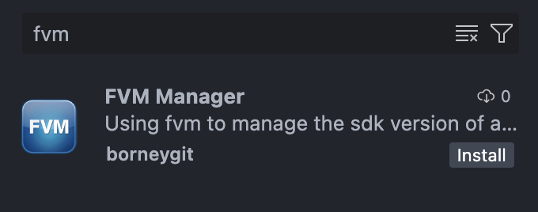
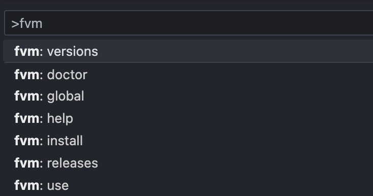
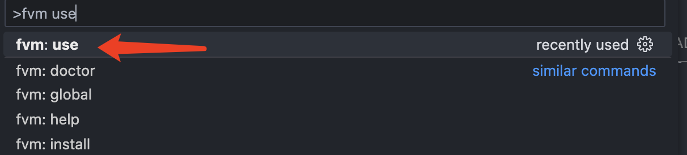
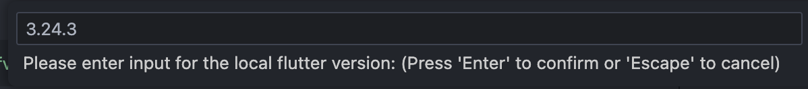
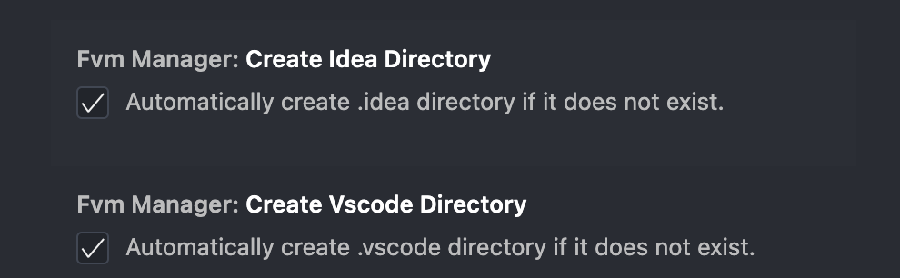

# FVM Manager
这是一个vscode插件，用于管理fvm的版本。

## 说明
在开发或阅读Flutter项目中,我们经常需要切换不同的Flutter版本，而fvm就是用于管理Flutter版本的工具。fvm manager是一个vscode插件，使用fvm管理不同flutter工程的版本，可以使工程沉浸式的在不同的Flutter版本之间切换。

## 安装
在vscode中搜索fvm manager，然后点击安装即可。[Marketplace](https://marketplace.visualstudio.com/items?itemName=borneygit.fvm-manager)

## 使用
在vscode的Command Palette中输入fvm，然后选择相应的命令即可。

### 命令解释
- fvm install: 安装fvm
- fvm list: 列出所有已安装的Flutter版本
- fvm release: 列出所有可用的Flutter版本
- fvm use: 切换到指定的Flutter版本,如果没有fvm会自动安装对应的版本
- fvm global: 设置全局的Flutter版本
- fvm doctor: 检查fvm的配置和依赖
- fvm help: 显示fvm的帮助信息

### 使用示例
在vscode的Command Palette中输入fvm use，

然后输入要切换的Flutter版本号，例如3.24.3，然后回车即可。

## 设置
fvm manager在使用use命令时会修该.vscode的settings.json配置，切换好vscode的Flutter版本, reload window就可以生效了 
同时也可以生成.idea的fvm配置内容，在Android Studio中切换Flutter版本

可以在设置中关闭这写配置
